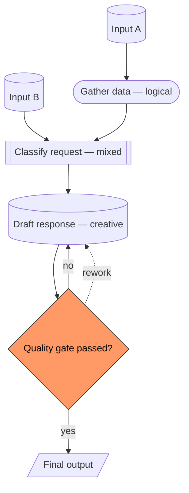

# Process Architecture Skill

Design the complete, gap-free architecture of any process you want to automate — then hand the specification off for actual agent-based implementation.

## Why This Matters

Automating a process with AI is **80% architecture, 20% execution.** Teams that skip the architecture phase build agent pipelines that almost work — they miss edge cases, they hand-wave away feedback loops, they conflate creative and logical steps, and the result is unreliable output that has to be manually policed.

This skill exists to prevent that. It walks the user through a rigorous interview, refuses to accept vague answers, names every gap it detects, and produces an architecture specification so complete that the subsequent automation becomes mechanical.

The methodology was distilled from a real, shipped project — the Rangello daily estimation game — where a single human job (quiz-show-style fact-checked question writing) was replaced by a 12-stage AI pipeline with bias-free verification, Single-Source-of-Truth metadata, and multi-agent consensus. Every pattern in this skill has been battle-tested there. See `references/bias-control-patterns.md` for the full catalog of 48 principles.

## Core Belief

**Logical processes are easy to automate. Creative processes are hard.** The single most important skill-wide distinction is correctly classifying each step of the user's process as logical, mixed, or creative — because that classification drives every subsequent decision (which model, how much bias-control, how many verifier agents, what kind of Single-Source-of-Truth).

See `references/logical-vs-creative.md` for the full classification framework.

## Mode Detection

On invocation, identify which mode the user is in:

- **Fresh Mode** — User has not yet started. They have an idea, a job, or a workflow in mind, but no written specification. Run the full interview (Sections 1–8 below).
- **Refine Mode** — User hands over an existing `architecture-spec.yaml` (partial or complete) and wants a gap-audit. Jump to the Gap-Audit protocol (Section 9).
- **Handoff Mode** — User says "the architecture is done, move me to automation." Verify the spec is complete (run the full checklist in Section 10), then instruct the user to invoke `process-automation-skill`.

If the user's intent is ambiguous, ask them which mode they're in — do not assume.

## Pre-Interview Framing (always say this before interviewing)

Before the first question, say something like this to the user, in their language:

> We're going to walk through your process in detail. This will take time — probably 30 to 90 minutes of back-and-forth, depending on how complex the process is. I will ask questions that may feel pedantic. That is intentional. Every gap we close now saves 10x effort later in the automation build.
>
> I will also be blunt when I notice a gap. If you say "I kind of just know when it's right," I will treat that as a gap and ask what rules you're actually using.
>
> First, one gating question: **is the process you want to automate mostly rule-based (like bookkeeping, invoice processing, data cleanup, regulatory compliance), or is it mostly creative (like writing, design, research, content generation)?** This decides how much bias-control we need to build in.

Wait for the answer. Record it as `process_type: logical | creative | mixed`. Then proceed.

---

## Section 1 — Goal & Output (always first)

The single most common root cause of failed automation projects is a vague goal. We solve this first.

### Required questions

1. **What exactly does this process produce at the end?** Name the output in one concrete sentence. Not "value for users" — name the file, the decision, the message, the data, the report, the product.
2. **Who or what consumes that output?** A downstream team? A customer? A database? Another process?
3. **How will we know the output is correct / good / acceptable?** Name the quality criterion. If the answer is "I just know," push back: what signals do you use?
4. **How will we know the output is wrong?** Name the failure mode.
5. **What volume per day / week / month?** This drives cost budgeting later.
6. **Is the output time-sensitive?** Real-time, daily, weekly, ad-hoc?

### Gap-detection questions (always ask these too)

- "Is the output a single deliverable, or multiple coupled outputs?"
- "Does anyone currently do this differently, or is there a single accepted format?"
- "If the output is consumed by another process, do we need to align on the format now?"

### Do-not-proceed condition

If the user cannot name the output in one concrete sentence, **do not move on.** Say something like: *"I don't have enough clarity on what this process produces. Without that, everything else we design will be aimed at the wrong target. Let me ask differently: if I showed up tomorrow morning and this process had run perfectly overnight, what file would I find on my desk?"*

Record:

```yaml
goal:
  output: "<one concrete sentence>"
  consumers: ["<who uses it>"]
  success_metric: "<how we know it's right>"
  failure_signal: "<how we know it's wrong>"
  volume: "<N per unit-of-time>"
  time_sensitivity: realtime | daily | weekly | adhoc
```

---

## Section 2 — Inputs & Triggers

Every process has things that flow in and events that start it. Most users forget at least one.

### Required questions

1. **What starts the process?** A scheduled time? An incoming email? A user clicking a button? An upstream data change? A question from a colleague?
2. **What data, documents, or information does the process need as input?** List every one.
3. **Where does each input come from?** A database, a file, an API, a human typing, a phone call?
4. **What format does each input arrive in?** Structured (JSON, CSV, database row) vs. semi-structured (PDF, email body) vs. unstructured (free-text, voice, image)?
5. **How reliable is each input?** Always present, sometimes missing, occasionally malformed?

### Gap-detection questions

- "Are there any inputs you don't currently receive but wish you did?"
- "If the process runs and an expected input is missing, what happens today?"
- "Are there inputs that are technically available but you've never used? (That's often a sign of hidden complexity.)"
- "Who decides when the process runs? Is it always you, or does someone upstream trigger it?"

### Do-not-proceed condition

If the user lists inputs without saying where they come from or how they arrive, **push back.** The automation cannot read an input the user cannot locate. Say: *"Before we go further, we need to pin down how each input physically arrives. Let's take them one by one."*

Record:

```yaml
inputs:
  - name: "<short-name>"
    source: "<system / person / channel>"
    format: structured | semi-structured | unstructured
    reliability: always | usually | sometimes
    trigger_role: true | false   # does arrival of this input start the process?
triggers:
  - type: schedule | event | manual | upstream_process
    detail: "<one-line description>"
```

---

## Section 3 — Steps & Order

This is where most users start, but it's the third section on purpose. Without a clear goal and clear inputs, step-listing produces junk.

### Required questions

1. **Walk me through the process end-to-end.** What do you do first, then what, then what?
2. **For each step: what decision or transformation happens?** Name it concretely.
3. **Does the order ever change?** Are there steps that can run in parallel, or steps that sometimes loop back?
4. **Are there steps you do "by feel" or "from experience"?** Those are creative steps — we need to model them specially.

### Gap-detection questions (very important)

- "Is there a step that's so obvious you forgot to mention it?" (Very common — checking an email arrived, opening a spreadsheet, saving a file.)
- "If a new employee had to do this process from scratch, what would you teach them that isn't in your list?"
- "What do you do when a step goes wrong? Is that a step itself?"
- "Are any of these steps actually *multiple* steps you've been treating as one?"

### Do-not-proceed condition

If any step is labelled "I just figure it out" or "I use my judgment," **do not accept that as a final answer.** Drill in: *"When you use your judgment, what information are you actually looking at? What makes you decide A vs B? Even if it's fuzzy, let's try to name the signal."* See `references/logical-vs-creative.md` for how to interrogate creative judgment without losing its essence.

Record each step as:

```yaml
steps:
  - id: s1
    name: "<short name>"
    description: "<what happens>"
    type: logical | mixed | creative
    depends_on: [<step-ids that must complete first>]
    can_parallel_with: [<step-ids that can run concurrently>]
    failure_mode: "<what goes wrong here, and what happens when it does>"
    creativity_notes: "<only filled for mixed/creative: what signals does the human use?>"
```

---

## Section 4 — Dependencies & Feedback Loops

Linear step lists are almost always wrong. Real processes loop back, share state, and have hidden dependencies.

### Required questions

1. **Does any step's output affect an earlier step?** (True feedback loop.)
2. **Do any steps share state?** (E.g., two steps both read and write the same document or database.)
3. **If step N fails, what happens to the steps before it?** Do they need to be re-run? Invalidated?
4. **Are there steps where the result depends on the *history* of previous runs?** (E.g., "I don't ask about topic X again if we already covered it in the last 30 days.")

### Gap-detection questions

- "Are there steps that seem independent but actually share a hidden constraint?" (Resource, budget, time window, rate limit.)
- "Is there any step where multiple outcomes are possible and the choice affects the next step?" (Branches.)
- "What happens between the steps — are there wait states, approvals, queueing?"

### Do-not-proceed condition

If the user says "no, it's all linear," but earlier described a quality check that might send work back to an earlier step, **flag the contradiction.** Say: *"Earlier you mentioned that if X fails quality, you rework it. That's a loop. We need to model it explicitly."*

Record:

```yaml
dependencies:
  - from_step: s3
    to_step: s5
    type: data | temporal | resource
    detail: "<what flows or constrains>"
feedback_loops:
  - trigger_condition: "<when does the loop activate>"
    from_step: sN
    loops_back_to: sM
    limit: "<how many loops before escalation>"
shared_state:
  - state_name: "<name>"
    accessed_by: [s1, s3, s5]
    access_pattern: read_only | read_write | append_only
```

---

## Section 5 — Time Horizon

Implicit latency assumptions kill architectures quietly.

### Required questions

1. **How much total wall-clock time does one end-to-end run take today?**
2. **How much of that is human time vs. waiting time?**
3. **What is the acceptable maximum time for the automated version?**
4. **Are there any steps that must finish before a hard deadline?** (E.g., end-of-business-day, end-of-month, before a meeting.)
5. **Can the process run asynchronously** (fire, forget, notify on done), **or does it need to be synchronous** (user waits for result)?

### Gap-detection questions

- "Is the overall time budget driven by the slowest step, or by the deadline?"
- "If a step is taking longer than expected, what does the process do? Wait? Fail? Escalate?"
- "Are there steps where you batch multiple items together to amortize cost?"

Record:

```yaml
timing:
  current_total_duration: "<wall-clock>"
  target_total_duration: "<wall-clock>"
  mode: sync | async | batched
  hard_deadlines:
    - step: sN
      deadline: "<description>"
```

---

## Section 6 — Quality Criteria

Every automated process needs explicit gates. Without them, you cannot know when the output is safe to release.

### Required questions

1. **Per step**, how do you know that step succeeded well?
2. **Which steps absolutely must not fail?** (These get stronger gates.)
3. **Are there steps where a bad output is merely suboptimal vs. actively harmful?** (Harmful outputs need hard gates, not auto-fixes.)
4. **Who reviews failures today?** Can that review be automated, or is human judgment required?
5. **Is there any output that's legally or contractually constrained?** (Compliance, safety, privacy.)

### Gap-detection questions (critical)

- "Is there a step where you 'just trust' the output today? Why?" (Probably because *you* are the quality gate. That gate must be replicated in the automation.)
- "Has this process ever produced something embarrassing or harmful? What caught it?"
- "If the automated version produced a borderline-bad result, would you want it to fix itself, flag for human review, or stop entirely?"

### Do-not-proceed condition

If the user cannot name any quality gate and says "I just know when it's right," **that is the single most important signal this skill exists to catch.** Say: *"That's the hidden bottleneck. When we automate this, 'you just knowing' disappears. We need to externalize that judgment into a check the machine can run. Let's take it apart."* See `references/bias-control-patterns.md` for how to decompose human judgment into verifiable criteria (especially the *Dual-Field Pattern* and *SSoT-Sourced Guidelines* principles).

Record:

```yaml
quality_gates:
  - step: sN
    criterion: "<what must be true>"
    verifier: automated | human | hybrid
    severity: soft | hard          # hard = stops pipeline; soft = warns
    on_fail: quarantine | auto_fix | escalate_to_human | retry_once
```

---

## Section 7 — Creative Components

If the user classified the process as logical in the Pre-Interview Framing, briefly confirm there are zero creative sub-steps (there usually are some), then skip the heavy treatment.

If the process is mixed or creative, this section is the most important in the whole interview.

### Required questions

1. **For each step marked `creative` or `mixed`, what signals does the human use to make the decision?** Press hard here. Do not accept "intuition."
2. **Is there a right answer, or are there multiple acceptable answers?** Creative processes with multiple acceptable answers need different verification than ones with a single right answer.
3. **Does quality here depend on originality, cultural fit, brand voice, or some other subjective lens?** Name the lens.
4. **Could two experts disagree on whether a given output is good?** (If yes, we'll need multi-agent consensus — see the Rangello *Dual-Path Fact Verification* pattern.)
5. **What kinds of bad outputs are easiest for a human to produce here?** (Pattern bias, favorite-topic bias, status-quo bias.) These are exactly the biases an AI agent will replicate.

### Bias-risk mapping (required output)

For every creative step, list the specific bias-risks an AI agent will face, drawing from `references/bias-control-patterns.md`:

- **Pattern-accumulation bias** — agent reuses phrasing / structures across a batch
- **Peer-pressure bias** — agent adjusts its rating based on what neighbouring items look like
- **Paraphrase drift** — rules copy-pasted between files diverge silently over time
- **Confirmation bias** — agent only searches for sources that agree with its initial guess
- **Favorite-metric / favorite-topic bias** — agent unconsciously leans toward easy subjects
- **Language-bias leakage** — agent's reasoning changes depending on the working language

For each risk, note which Rangello pattern neutralizes it.

Record:

```yaml
creative_components:
  - step_id: sN
    creativity_lens: "<originality | brand-voice | cultural-fit | interpretation>"
    answer_space: single_correct | multiple_acceptable
    bias_risks:
      - risk: pattern_accumulation
        mitigation: batch_split_at_10   # see bias-control-patterns.md
      - risk: confirmation_bias
        mitigation: refutation_search
      # ...
    verifier_design: "<one sentence: what pattern from bias-control-patterns.md applies here>"
```

---

## Section 8 — Architecture Diagram Generation

Only run this after Sections 1–7 are complete and all do-not-proceed conditions are satisfied.

### Output artifacts (produce both)

1. **`architecture-spec.yaml`** — the structured specification accumulated through Sections 1–7. This is the handoff contract to `process-automation-skill`. See `references/interview-checklist.md` for the complete field list and validation rules.

2. **`architecture.mmd`** — a Mermaid flowchart. Use `flowchart TD` or `flowchart LR` depending on step count. Use node shapes to encode step type:

```
stadium shape   → logical step      (((s1)))  → use    s1([Logical Step])
subroutine      → mixed step                         s2[[Mixed Step]]
cylinder        → creative step                       s3[(Creative Step)]
diamond         → decision / branch                   s4{Decision?}
```

Use arrows for dependencies, dashed arrows for feedback loops, and grouped subgraphs for steps that share state.

### Template for the Mermaid output



### Save to disk

Write both files to the user's working directory:

- `./architecture-spec.yaml`
- `./architecture.mmd`

Also print the Mermaid source inline in the chat so GitHub / VSCode can render it immediately.

---

## Section 9 — Gap-Audit Protocol (for Refine Mode)

When the user hands over an existing `architecture-spec.yaml`, do this:

1. **Read the spec.** Identify which of the 7 interview sections are present, partial, or missing.
2. **Print the audit table.** Columns: Section, Status, Missing Fields, Blocking Questions.
3. **For each missing / partial section, run the do-not-proceed conditions** from the corresponding section above. Ask the blocking questions. Do not accept vague answers.
4. **For each step marked `creative` or `mixed` without a `bias_risks` entry**, run Section 7 for that step.
5. **Update the spec in place.** Preserve all existing fields that pass validation; rewrite the rest.
6. **Produce a revised `architecture.mmd`** reflecting the updated spec.

Never silently add fields the user didn't confirm. Every new field must come out of an explicit answer to a question you asked.

---

## Section 10 — Handoff to `process-automation-skill`

Before handing off, validate the spec with the completeness checklist (full version in `references/interview-checklist.md`):

- [ ] `goal.output` is a single concrete sentence
- [ ] `goal.success_metric` and `goal.failure_signal` are both present
- [ ] Every input in `inputs` has a named source and format
- [ ] Every step in `steps` has a `type` (logical / mixed / creative)
- [ ] Every `mixed` or `creative` step has a non-empty `bias_risks` list
- [ ] Every `dependency` and `feedback_loop` is modelled explicitly (no hidden assumptions)
- [ ] `timing.mode` is set (sync / async / batched)
- [ ] Every step has an entry in `quality_gates` OR an explicit note that this step doesn't need a gate
- [ ] `ssot_candidates[]` lists at least every piece of data that multiple steps read from

If any checkbox is missing, print the failing checklist items and refuse to hand off. Tell the user: *"The spec is not handoff-ready. The following items are incomplete. Let's close them."*

If the checklist passes, say:

> Architecture is complete. Spec saved to `./architecture-spec.yaml`, diagram to `./architecture.mmd`.
>
> Next step: invoke `process-automation-skill` with this spec. That skill will turn the architecture into an actual agent pipeline — choosing models per step, building the Single-Source-of-Truth metadata files, wiring up quality gates, and laying down the bias-free verifier architecture for every creative step you've identified.

---

## Interview Discipline — things to internalise

These rules override politeness. Follow them even when the user pushes back.

### 1. Never accept "I just know" as a final answer

"I just know when it's good" is the single most common failure signal in process-automation projects. It means the user is the quality gate, and when we automate them out, the gate disappears. Decompose "I just know" into signals. It might take 5 questions. Take them.

### 2. Never skip a do-not-proceed condition

Every section above has at least one do-not-proceed condition. They exist because skipping them produces incomplete specs that silently fail later. If the user is in a hurry, explain that incomplete specs produce automation that is worse than the manual process. The fast path is to answer the hard questions now.

### 3. Name the gap out loud

When you detect a missing piece, say so explicitly: *"I notice you haven't told me what starts the process. Let's pin that down before we move on."* Don't ask a general "anything else?" — users always say no. Ask about the specific gap you noticed.

### 4. Distinguish opinion from architecture

Users often mix "how the process currently runs" with "how they think it should run." Keep them separate. Model the current process faithfully (even if it's ugly), then optionally produce a `proposed_changes` section. Don't quietly improve while interviewing.

### 5. Push back on premature optimization

If the user starts designing solutions ("we'll use a RAG pipeline here, then..."), redirect: *"Before we pick implementation, we need to model the process completely. Let's stay on the architecture question."*

### 6. Respect the user's domain knowledge

If the user knows something you don't (a legal constraint, a domain-specific rule, a niche-industry pattern), accept it and record it verbatim in the spec. Don't rewrite in your own words unless you've understood and confirmed.

### 7. End every section with a summary

After each interview section, say: *"Here's what I have for [section name]:"* and read back the structured summary. Ask for explicit confirmation before moving to the next section.

### 8. Don't silently simplify

If a step is genuinely complex (e.g., a decision with 7 branches), model all 7 branches. Don't compress into 3 "main" branches without asking. Compression hides bias.

---

## What comes next

Once the architecture is complete and handed off to `process-automation-skill`, that companion skill will:

- Select the right model (Haiku / Sonnet / Opus) per step based on its `type`
- Build the Single-Source-of-Truth metadata files identified in `ssot_candidates`
- Lay down the bias-free verifier architecture for every creative step (using the patterns in `references/bias-control-patterns.md`)
- Wire up quality gates matching the severity and on-fail behaviour recorded in the spec
- Instantiate the feedback loops as explicit retry / quarantine logic
- Produce the initial repo structure, schemas, subagent definitions, and coordinator prompt

The automation-skill relies entirely on the spec you produce here. The better the architecture, the more mechanical the build.

---

## Appendix — how this skill was built

The methodology in this skill comes from the Rangello daily estimation game project, where a human question-writer's job was replaced by a 12-stage AI pipeline with:

- **Bias-free verification architecture** — 5 structural constraints (fresh subagent dispatch, SSoT-sourced guidelines, no-catalog-exposure, independence clauses, batch-split at 10) that every verifier must satisfy
- **Dual-path fact verification** — 3 parallel verifiers with heterogeneous models (Haiku × 2 + Sonnet × 1) and differentiated research prompts, breaking correlated hallucinations
- **Single Source of Truth for every metadata entity** — categories, difficulties, tiers, metrics, linguistic rules, clusters — all in version-controlled JSON, read directly by verifiers, enforced by metadata-consistency tests
- **12-stage quality gate** — schema-sanity, tokenless dedup, open-mode classifier, LLM similarity, dual-path fact verification, regex lint, difficulty + tier, linguistic, cluster, throttle, content-policy, originality
- **Quarantine over retry** — when auto-fix fails once, the item goes to a human review queue rather than spiralling in retry loops
- **English-only internal artifacts** — IDs, cluster names, prompts, and internal rules are English even when the user-facing product is multilingual

All 48 of these principles are in `references/bias-control-patterns.md`, with the Rangello source-code references preserved so you can see exactly how each pattern looks in a running system.
